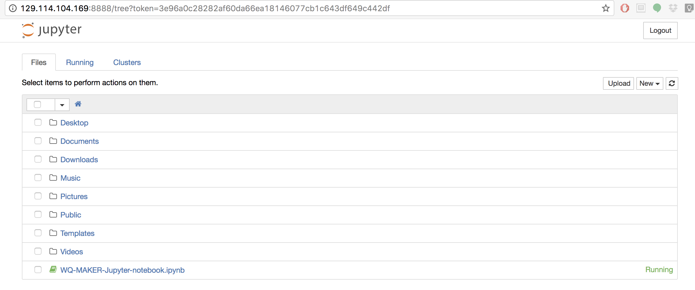

.. include:: cyverse_rst_defined_substitutions.txt
.. include:: custom_urls.txt

|CyVerse_logo|_

|Home_Icon|_
`Learning Center Home <http://learning.cyverse.org/>`_

**MAKER Genome Annotation using cc-tools and Jetstream(WQ-MAKER)**
==================================================================

**Part 4: Set up a MAKER run using the Jupyter notebook**
~~~~~~~~~~~~~~~~~~~~~~~~~~~~~~~~~~~~~~~~~~~~~~~~~~~~~~~~~

Step1: Running "tmux" command to run the anlaysis in the background:

.. code-block:: bash

    $ cd ~
    $ tmux

Step2: Copy the example Jupyter notebook onto your home directory:

.. code-block:: bash

    $ cp /opt/WQ-MAKER_example_data/WQ-MAKER-Jupyter-notebook.ipynb .

Step3: Launch jupyter notebook in the background:

.. code-block:: bash

    $ python /opt/anaconda2/bin/jupyter-notebook --no-browser --ip=0.0.0.0 2>&1 | sed s/0.0.0.0/$(curl -s ipinfo.io/ip)/g
    [I 16:54:10.440 NotebookApp] Writing notebook server cookie secret to /run/user/1000/jupyter/notebook_cookie_secret
    [I 16:54:10.650 NotebookApp] Serving notebooks from local directory: /home/upendra
    [I 16:54:10.650 NotebookApp] 0 active kernels
    [I 16:54:10.650 NotebookApp] The Jupyter Notebook is running at:`Jupyternotebookrunninglink <http://129.114.104.169:8888/?token=483a27cd0387ccd04133570999ba8ce8072cf0f45663289f>`__
    [I 16:54:10.650 NotebookApp] Use Control-C to stop this server and shut down all kernels (twice to skip confirmation).
    [C 16:54:10.650 NotebookApp]

        Copy/paste this URL into your browser when you connect for the first time,
        to login with a token:
            `Copylinkbelow <http://129.114.104.169:8888/?token=483a27cd0387ccd04133570999ba8ce8072cf0f45663289f>`__ ## Copy and paste this link in the browser

Step 4: Now click open "WQ-MAKER-Jupyter-notebook.ipynb" and run the jupyter notebooks.

|WQ-Maker15|

Here is the example Jupyter notebook that was ran before

`Jupyter Example <http://nbviewer.jupyter.org/github/upendrak/WQ-MAKER_example_data/blob/master/WQ-MAKER-Jupyter-notebook-demo.ipynb>`__

**Note**
~~~~~~~~~
If you want to exit out of tmux shell without killing it. Press ctrl + b and d. If you want to kill it. Then press ctrl +c

----

Additional information, help
~~~~~~~~~~~~~~~~~~~~~~~~~~~~

..
    Short description and links to any reading materials

Search for an answer:
|CyVerse Learning Center| or
|CyVerse Wiki|

Post your question to the user forum:
|Ask CyVerse|

----

**Fix or improve this documentation**

- Search for an answer:
  |CyVerse Learning Center|
- Ask us for help:
  click |Intercom| on the lower right-hand side of the page
- Report an issue or submit a change:
  |Github Repo Link|
- Send feedback: `learning@CyVerse.org <learning@CyVerse.org>`_

----
|Home_Icon|_
`Learning Center Home <http://learning.cyverse.org/>`__

.. Comment: Place Images Below This Line
   use :width: to give a desired width for your image
   use :height: to give a desired height for your image
   replace the image name/location and URL if hyperlinked

 .. |Clickable hyperlinked image| image:: ./img/IMAGENAME.png
    :width: 500
    :height: 100
 .. _CyVerse logo: http://learning.cyverse.org/

 .. |Static image| image:: ./img/IMAGENAME.png
    :width: 25
    :height: 25

.. |De app| image:: ./img/apps.png

.. Comment: Place URLS Below This Line

   # Use this example to ensure that links open in new tabs, avoiding
   # forcing users to leave the document, and making it easy to update links
   # In a single place in this document

   .. |Substitution| raw:: html # Place this anywhere in the text you want a hyperlink

      <a href="REPLACE_THIS_WITH_URL" target="blank">Replace_with_text</a>

.. |Github Repo Link|  raw:: html

   <a href="FIX_FIX_FIX_FIX_FIX_FIX_FIX_FIX_FIX_FIX_FIX_FIX_FIX_FIX_FIX" target="blank">Github Repo Link</a>

.. |Download Cyberduck| raw:: html

   <a href="https://cyberduck.io/" target="blank">Download Cyberduck</a>

.. |Part1&2| file:: ./Part1&2.rst
